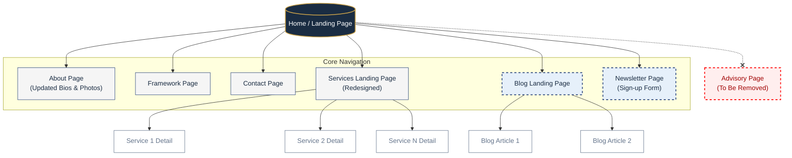

# Proposed Website Architecture & Navigation Flow

The following flowchart illustrates the updated website structure based on the PRD requirements, including the removal of the Advisory section and the introduction of the new Blog, Newsletter, and individual Service pages.

### Legend
- **Solid Outline (Navy):** Existing pages with updates
- **Dashed Outline (Blue):** New modules added (Blog & Newsletter)
- **Thin Outline (Grey):** Individual dynamic detail pages
- **Dashed Red:** Sections being removed (Advisory)
